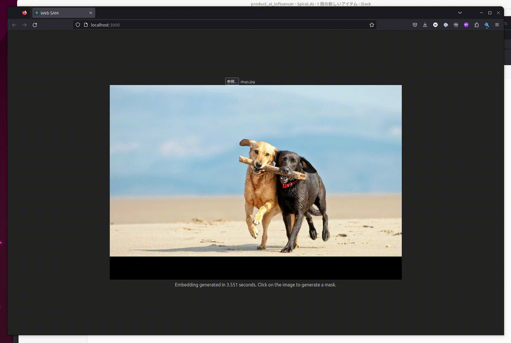

# Web SAM

## Installation

```sh
yarn install
yarn setup
# Download models
wget https://github.com/neka-nat/web-sam/releases/download/1.0.0/mobilesam.decoder.quant.onnx -P public/models
wget https://github.com/neka-nat/web-sam/releases/download/1.0.0/mobilesam.encoder.onnx -P public/models
yarn start
```

## Demo


